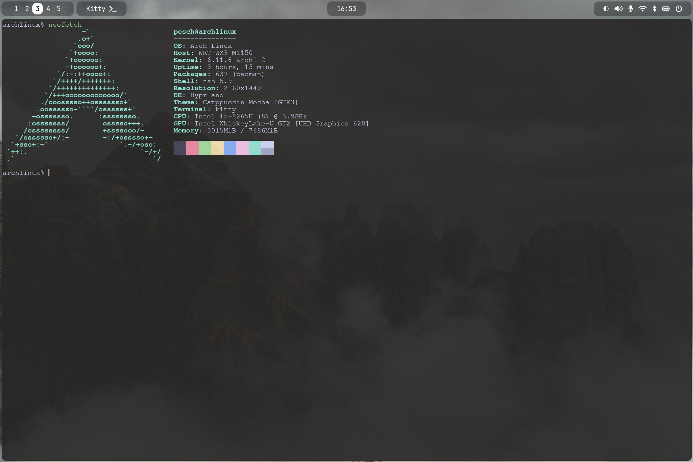
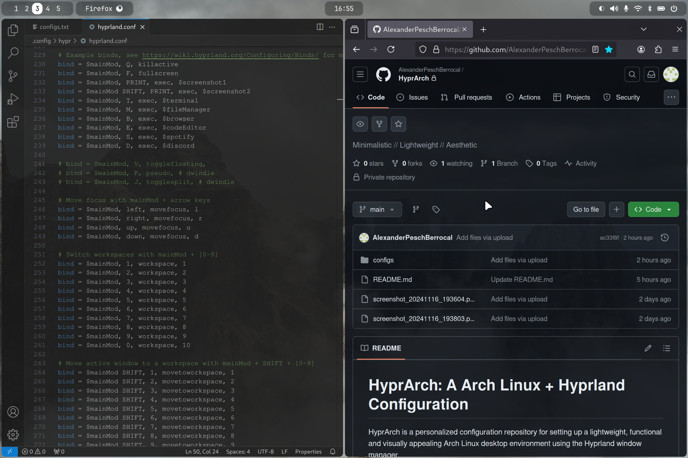
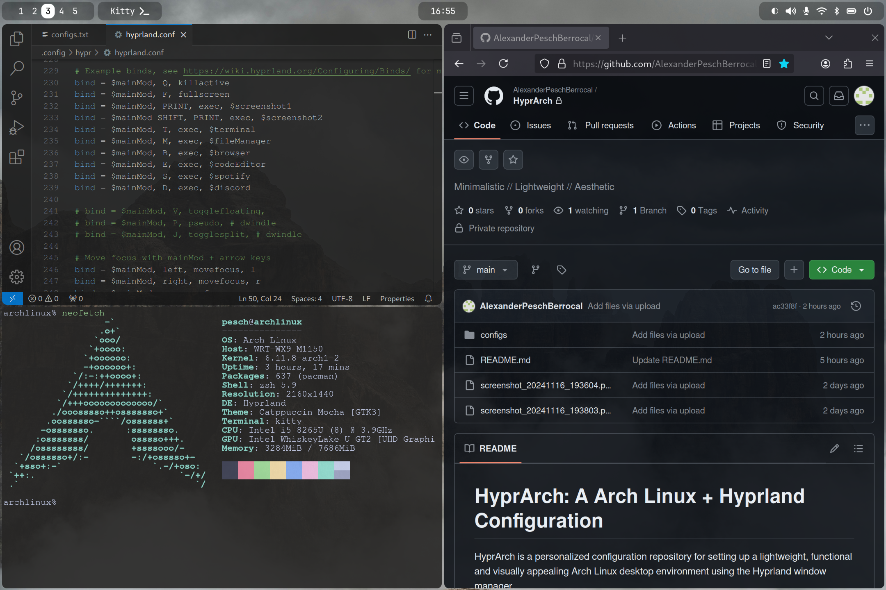

# HyprArch
HyprArch is a personalized configuration repository for setting up a lightweight, functional and visually appealing Arch Linux desktop environment using the Hyprland window manager.

---

## Features
- **Fonts**: JetBrainsMono Nerd Font and Font Awesome
- **Cursor Themes**: Bibata Cursor Themes
- **GRUB**: Boot loader
- **SDDM**: Display manager
- **Hyprland**: Window manager
- **Grim** and **Slurp**: Tools for taking screenshots
- **Hyprpaper**: Wallpaper manager
- **Hypridle**: Idle manager
- **Hyprlock**: Lockscreen
- **Waybar**: Status bar
- **Pavucontrol**: Audio management utility
- **Blueman**: Bluetooth management tool
- **Wlogout**: Logout menu
- **Kitty**: Terminal emulator
- **Zsh** and **Oh-My-Zsh**: Shell setup
- **Dolphin**: File manager
- **Firefox**: Browser
- **Code**: Code editor
- **Spotify**: Music
- **Discord**: Communication

---

## Showcase
<details>
  
  <summary>Click to view images</summary>
  
  
  
  
  
  
  
  
</details>

---

## Disclaimer
This repository is intended for personal use and may require additional tweaks to fit your specific setup. All important links and resources can be found at the bottom of this page.

---

## Prerequisites
Before proceeding with the installation, make sure you have:
- A minimal Arch Linux installation
- Basic knowledge of Arch Linux

---

## Installation

### Step 1: Install Required Packages
You will need the following packages. Use `pacman` for official packages and an AUR helper like `yay` for AUR packages.

#### Official packages
```
sudo pacman -S ttf-jetbrains-mono-nerd ttf-font-awesome grub sddm hyprland grim slurp hyprpaper hypridle hyprlock waybar pavucontrol blueman kitty zsh dolphin firefox code discord git base-devel
```

#### AUR packages
```
yay -S bibata-cursor-theme-bin wlogout oh-my-zsh spotify  
```

#### Yay installation
If you don't have `yay` installed, you can set it up with:
```
cd ~
git clone https://aur.archlinux.org/yay.git
cd yay
makepkg -si
```

### Step 2: Configure Installed Packages
Set SDDM as your display manager:
```
sudo systemctl enable sddm
```

Switch your shell to zsh:
```
chsh -s $(which zsh)
```

### Step 3: Clone The Repository
Clone this repository to your home directory:
```
cd ~
git clone https://github.com/AlexanderPeschBerrocal/HyprArch.git
```

### Step 4: Apply Configuration Files  
Move the provided configuration files to their respective directories. Replace existing files if necessary. Use the following table as a reference for where to place each configuration file:

| Component          | Configuration File(s)                           | Destination Path(s)                                   |
|--------------------|-------------------------------------------------|-------------------------------------------------------|
| **GRUB**           | `grub`, `40_custom`, `retroboot`                | `/etc/default/`, `/etc/grub.d/`, `/boot/grub/themes/` |
| **SDDM**           | `default.conf`, `sugar-candy`                   | `/etc/sddm.conf.d/`, `usr/share/sddm/themes/`         |
| **Hyprland**       | `hyprland.conf`                                 | `~/.config/hypr/`                                     |
| **Hyprpaper**      | `hyprpaper.conf`                                | `~/.config/hypr/`                                     |
| **Hypridle**       | `hypridle.conf`                                 | `~/.config/hypr/`                                     |
| **Hyprlock**       | `hyprlock.conf`                                 | `~/.config/hypr/`                                     |
| **Waybar**         | `config.jsonc`, `style.css`                     | `~/.config/waybar/`                                   |
| **Wlogout**        | `layout`, `style.css`                           | `~/.config/wlogout/`                                  |
| **Kitty**          | `kitty.conf`, `theme.conf`                      | `~/.config/kitty/`                                    |
| **Zsh**            | `.zshrc`                                        | `~/`                                                  |
| **Code**           | `code-flags.conf`                               | `~/.config/`                                          |
| **Spotify**        | `spotify-flags.conf`                            | `~/.config/`                                          |

Example command to copy Hypr configurations:  
```
sudo cp -r ~/HyprArch/configs/.config/hypr ~/.config/
```

Run the following command after setting up the GRUB configs:
```
sudo grub-mkconfig -o /boot/grub/grub.cfg
sudo grub-mkconfig -o /boot/EFI/arch/grub.cfg
```

### Step 5: (Optional) Make Changes
- Set screen resolution
- Set kayboard layout
- ...

---

## Links And Resources

**Arch Linux**:
- https://wiki.archlinux.org/title/Installation_guide
- https://archlinux.org/download
- https://rufus.ie/en

**yay**:
- https://github.com/Jguer/yay

**Fonts**
- https://archlinux.org/packages/extra/any/ttf-jetbrains-mono-nerd
- https://archlinux.org/packages/extra/any/ttf-font-awesome

**Cursor Themes**
- https://github.com/ful1e5/Bibata_Cursor

**GRUB**:
- https://www.gnu.org/software/grub/manual/grub/grub.html
- https://wiki.archlinux.org/title/GRUB
- https://github.com/vinceliuice/Elegant-grub2-themes

**SDDM**:
- https://github.com/sddm/sddm
- https://wiki.archlinux.org/title/SDDM
- https://github.com/Kangie/sddm-sugar-candy

**hyprland**:
- https://wiki.hyprland.org
- https://github.com/hyprwm/Hyprland
- https://wiki.archlinux.org/title/Hyprland

**grim**:
- https://github.com/emersion/grim

**slurp**:
- https://github.com/emersion/slurp

**hyprpaper**:
- https://wiki.hyprland.org/Hypr-Ecosystem/hyprpaper

**hypridle**:
- https://wiki.hyprland.org/Hypr-Ecosystem/hypridle

**hyprlock**:
- https://wiki.hyprland.org/Hypr-Ecosystem/hyprlock

**waybar**:
- https://github.com/Alexays/Waybar

**pavucontrol**:
- https://wiki.archlinux.org/title/PulseAudio

**blueman**:
- https://wiki.archlinux.org/title/Blueman

**wlogout**
- https://github.com/ArtsyMacaw/wlogout

**kitty**
- https://sw.kovidgoyal.net/kitty
- https://github.com/kovidgoyal/kitty
- https://github.com/catppuccin/catppuccin

**zsh**
- https://zsh.sourceforge.io/Doc/Release/zsh_toc.html
- https://github.com/ohmyzsh/ohmyzsh
- https://wiki.archlinux.org/title/Zsh

**dolphin**
- https://apps.kde.org/dolphin
- https://github.com/KDE/dolphin
- https://wiki.archlinux.org/title/Dolphin
