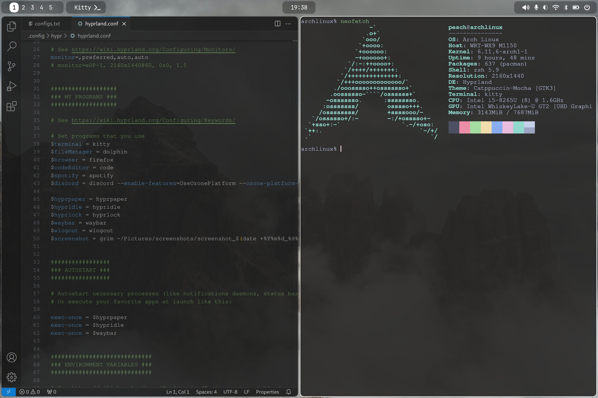

# HyprArch: A Arch Linux + Hyprland Configuration

HyprArch is a personalized configuration repository for setting up a lightweight, functional and visually appealing Arch Linux desktop environment using the Hyprland window manager.

---

## Showcase

<details>
  <summary>Click to view images</summary>
  
  
  
  
</details>

---

## Prerequisites
Before proceeding, ensure you have:
- A minimal Arch Linux installation
- Basic knowledge of Arch Linux

---

## Installation

### Step 1: Install Required Packages
Use `pacman` or your preferred AUR helper like `yay` to install the following packages:

1. **grub** (boot loader)
2. **sddm** (display manager)
3. **hyprland** (window manager)
   - **grim**: for screenshots
   - **slurp**: for screen region selection
4. **hyprpaper** (wallpaper management)
5. **hypridle** (idle management)
6. **hyprlock** (lock screen)
7. **waybar** (status bar)
   - **pavucontrol**: for audio
   - **blueman**: for bluetooth
8. **wlogout** (logout menu)
9. **kitty** (terminal emulator)
10. **zsh** (shell)
    - **oh-my-zsh**: zsh framework
11. **dolphin** (file manager)
12. **firefox** (browser)
13. **code** (code editor)
14. **spotify** (music streaming)
15. **discord** (communication)

Install these packages using:
```
sudo pacman -S [package_names]
# or use an AUR helper like yay
yay -S [aur_package_names]
```

### Step 2: Clone The Repository
Clone this repository to your home directory using:
```
sudo pacman -S git
cd ~
git clone https://github.com/AlexanderPeschBerrocal/HyprArch.git
```

### Step 3: Move And Replace Configuration Files
Move the provided configuration files to their appropriate directories. Make sure to replace already existing configuration files if necessary.

Example:
`sudo cp -r ~/HyprArch/configs/.config/hypr ~/.config/`

### Step 4: (Optional) Make Changes

#### 1. GRUB
- **main configuration**: `/etc/default/grub`
- **windows 11 dual boot settings**: `/etc/grub.d/40_custom`
- **GRUB theme**: `/boot/grub/themes/retroboot`

After modifying GRUB configurations, update GRUB with:
```
sudo grub-mkconfig -o /boot/grub/grub.cfg
sudo grub-mkconfig -o /boot/EFI/arch/grub.cfg
```

#### 2. SDDM
- **main configuration**: `/etc/sddm.conf.d/default.conf`
- **SDDM theme**: `/usr/share/sddm/themes/sugar-candy`

#### 3. hyprland
- **main configuration**: `~/.config/hypr/hyprland.conf`

#### 4. hyprpaper
- **main configuration**: `~/.config/hypr/hyprpaper.conf`

#### 5. hypridle
- **main configuration**: `~/.config/hypr/hypridle.conf`

#### 6. hyprlock
- **main configuration**: `~/.config/hypr/hyprlock.conf`

#### 7. waybar
- **main configuration**: `~/.config/waybar/config.jsonc`
- **styling configuration**: `~/.config/waybar/style.css`

#### 8. wlogout
- **main configuration**: `~/.config/wlogout/layout`
- **styling configuration**: `~/.config/wlogout/style.css`

#### 9. kitty
- **main configuration**: `~/.config/kitty/kitty.conf`
- **kitty theme**: `~/.config/kitty/theme.conf`

#### 10. zsh
- **main configuration**: `~/.zshrc`

#### 11. dolphin

#### 12. firefox

#### 13. code
- **start flags**: `~/code-flags.conf`

#### 14. spotify
- **start flags**: `~/spotify-flags.conf`

#### 15. discord
- **start flags**: `discord --enable-features=UseOzonePlatform --ozone-platform-hint=wayland`

---

## Links
**Arch Linux**:
- https://wiki.archlinux.org/title/Installation_guide

**GRUB**:
- https://www.gnu.org/software/grub/manual/grub/grub.html
- https://wiki.archlinux.org/title/GRUB

**SDDM**:
- https://github.com/sddm/sddm
- https://wiki.archlinux.org/title/SDDM

**hyprland**:
- https://wiki.hyprland.org
- https://github.com/hyprwm/Hyprland
- https://wiki.archlinux.org/title/Hyprland

**grim**:
- https://github.com/emersion/grim

**slurp**:
- https://github.com/emersion/slurp

**hyprpaper**:
- https://wiki.hyprland.org/Hypr-Ecosystem/hyprpaper

**hypridle**:
- https://wiki.hyprland.org/Hypr-Ecosystem/hypridle

**hyprlock**:
- https://wiki.hyprland.org/Hypr-Ecosystem/hyprlock

**waybar**:
- https://github.com/Alexays/Waybar

**pavucontrol**:
- https://wiki.archlinux.org/title/PulseAudio

**blueman**:
- https://wiki.archlinux.org/title/Blueman

**wlogout**
- https://github.com/ArtsyMacaw/wlogout

**kitty**
- https://sw.kovidgoyal.net/kitty
- https://github.com/kovidgoyal/kitty

**zsh**
- https://zsh.sourceforge.io/Doc/Release/zsh_toc.html
- https://github.com/ohmyzsh/ohmyzsh
- https://wiki.archlinux.org/title/Zsh

**dolphin**
- https://apps.kde.org/dolphin
- https://github.com/KDE/dolphin
- https://wiki.archlinux.org/title/Dolphin
