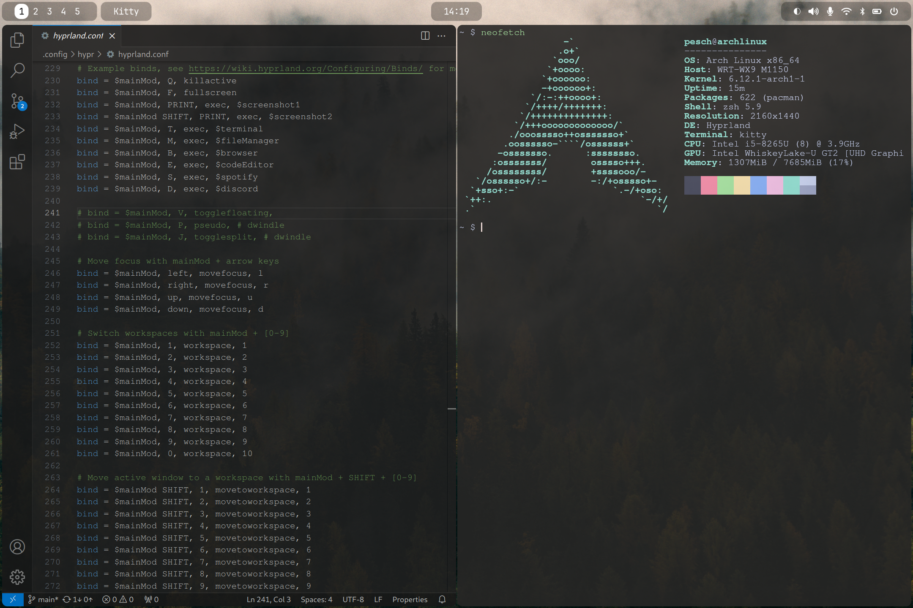

# HyprArch
HyprArch is a personalized configuration repository for setting up a lightweight, functional and visually appealing Arch Linux desktop environment using the Hyprland window manager.

---

## Disclaimer
This repository is intended for personal use and may require additional tweaks to fit your specific setup. All important links and resources can be found at the bottom of this page.

---

## Features
<details>
  
  <summary>Click to view features</summary>

  - **Fonts**: JetBrainsMono Nerd Font and Font Awesome
  - **Cursor Themes**: Bibata Cursor Themes
  - **GRUB**: Boot loader + Theme
  - **SDDM**: Display manager + Theme
  - **Hyprland**: Window manager
  - **Grim** and **Slurp**: Sceenshot tools
  - **Hyprpaper**: Wallpaper manager
  - **Hypridle**: Idle manager
  - **Hyprlock**: Lockscreen
  - **Waybar**: Status bar
  - **Pavucontrol**: Audio management tool
  - **Blueman**: Bluetooth management tool
  - **Wlogout**: Logout menu
  - **Kitty**: Terminal emulator + Theme
  - **Zsh** and **Oh-My-Zsh**: Shell setup
  - **Dolphin**: File manager
  - **Firefox**: Browser
  - **Code**: Code editor
  - **Spotify**: Music
  - **Discord**: Communication

</details>

---

## Showcase
<details>
  
  <summary>Click to view Showcase</summary>
  
  
  
  
  
  
</details>

---

## Prerequisites
Before proceeding with the installation, make sure you have:
- A minimal Arch Linux installation

---

## Installation

```
cd ~
git clone https://github.com/AlexanderPeschBerrocal/HyprArch.git
cd HyprArch
chmod +x install.sh
./install.sh
```

---

## Links And Resources

**Arch Linux**:
- https://wiki.archlinux.org/title/Installation_guide
- https://archlinux.org/download
- https://rufus.ie/en

**Fonts**
- https://archlinux.org/packages/extra/any/ttf-jetbrains-mono-nerd
- https://archlinux.org/packages/extra/any/ttf-font-awesome

**Cursor Themes**
- https://github.com/ful1e5/Bibata_Cursor

**GRUB**:
- https://www.gnu.org/software/grub/manual/grub/grub.html
- https://wiki.archlinux.org/title/GRUB
- https://github.com/vinceliuice/Elegant-grub2-themes

**SDDM**:
- https://github.com/sddm/sddm
- https://wiki.archlinux.org/title/SDDM
- https://github.com/Kangie/sddm-sugar-candy

**hyprland**:
- https://wiki.hyprland.org
- https://github.com/hyprwm/Hyprland
- https://wiki.archlinux.org/title/Hyprland

**grim**:
- https://github.com/emersion/grim

**slurp**:
- https://github.com/emersion/slurp

**hyprpaper**:
- https://wiki.hyprland.org/Hypr-Ecosystem/hyprpaper

**hypridle**:
- https://wiki.hyprland.org/Hypr-Ecosystem/hypridle

**hyprlock**:
- https://wiki.hyprland.org/Hypr-Ecosystem/hyprlock

**waybar**:
- https://github.com/Alexays/Waybar

**pavucontrol**:
- https://wiki.archlinux.org/title/PulseAudio

**blueman**:
- https://wiki.archlinux.org/title/Blueman

**wlogout**
- https://github.com/ArtsyMacaw/wlogout

**kitty**
- https://sw.kovidgoyal.net/kitty
- https://github.com/kovidgoyal/kitty
- https://github.com/catppuccin/catppuccin

**zsh**
- https://zsh.sourceforge.io/Doc/Release/zsh_toc.html
- https://github.com/ohmyzsh/ohmyzsh
- https://wiki.archlinux.org/title/Zsh

**dolphin**
- https://apps.kde.org/dolphin
- https://github.com/KDE/dolphin
- https://wiki.archlinux.org/title/Dolphin
